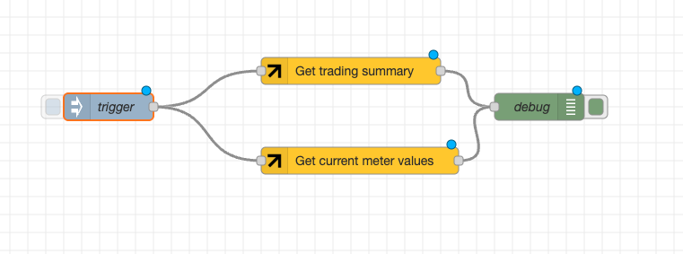

# eFriends node-red-api
## Introduction
These set of node-red nodes can be used to interact with the <a href="https://www.efriends.at" target="_blank">eFriends</a> API.

Currently the supported functionality includes:
* Gathering energy trading statistics
* Gathering grid meter values



## Trading summary

The trading summary node returns the following data:
```json
{
  "payload": {
    "startTime": "2025-06-03T07:35:20.000Z",
    "endTime": "2025-06-03T07:35:30.000Z",
    "unixTimestamp": 1748936130000,
    "cubeName": "P01_3003876",
    "aggregatedData": {
      "producer": true,
      "consumer": false,
      "pv": 0,
      "water": 0,
      "biogas": 0,
      "wind": 0,
      "toCommunity": 68,
      "fromCommunity": 0,
      "toSupplier": 0,
      "fromSupplier": 0,
      "toGrid": 68,
      "fromGrid": 0,
      "balance": 1156,
      "communityShareable": 0,
      "communityConsumable": 1156
    }
  },
  "topic": "efriends.trading.summary",
  "_msgid": "75c4c986d6b1e24f"
}
```

## Grid meter values

The grid meter values node returns the following data:
```json
{
  "payload": {
    "endTime": "2025-06-03T07:35:40Z",
    "startTime": "2025-06-03T07:35:30Z",
    "energyBalance": 65.5,
    "details": {
      "power1Watt": -1196.5,
      "power2Watt": 630,
      "power3Watt": 632,
      "current1Ampere": 5.199999999999999,
      "current2Ampere": -2.7,
      "current3Ampere": -2.7,
      "voltage1Volt": 232,
      "voltage2Volt": 235,
      "voltage3Volt": 234
    }
  },
  "topic": "efriends.gridmeter.values",
  "_msgid": "4f73e8aeb8b0ac6d"
}
```
